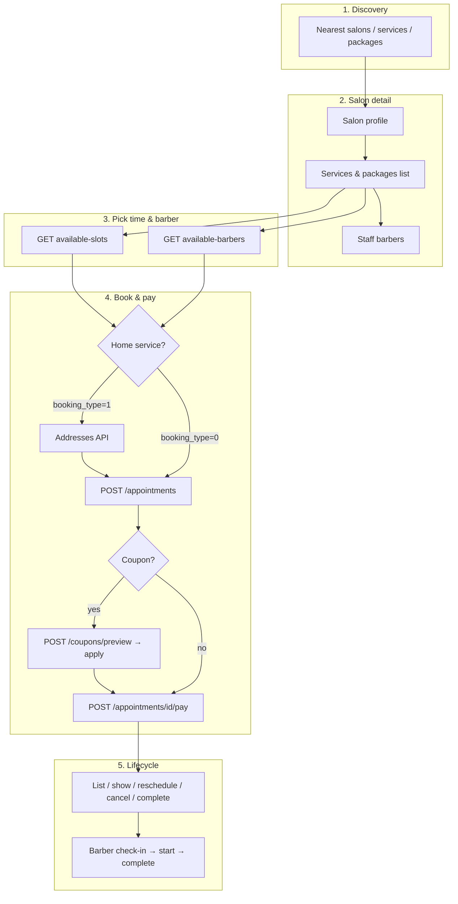

# Ronaq — Reservation (Booking) Flow & API

**Base URL:** `{APP_URL}/api/v1`  
**Auth:** `Authorization: Bearer {token}` (unless noted)  
**Collection:** `api_collectoin/ronaq.apidog.json`

This document describes the **client reservation flow** after the user selects one or more **services** and/or **packages**, and lists every related API endpoint.

---

## Table of contents

- [Core model](#core-model)
- [Duration & cart rules](#duration--cart-rules)
- [End-to-end flow](#end-to-end-flow)
- [Phase 1 — Discovery](#phase-1--discovery)
- [Phase 2 — Salon & catalog](#phase-2--salon--catalog)
- [Phase 3 — Schedule (slots & barbers)](#phase-3--schedule-slots--barbers)
- [Phase 4 — Coupon scope (optional)](#phase-4--coupon-scope-optional)
- [Phase 5 — Address (home service only)](#phase-5--address-home-service-only)
- [Phase 6 — Create appointment](#phase-6--create-appointment)
- [Phase 7 — Checkout coupon (optional)](#phase-7--checkout-coupon-optional)
- [Phase 8 — Pay](#phase-8--pay)
- [Phase 9 — After booking](#phase-9--after-booking)
- [Barber (staff) endpoints](#barber-staff-endpoints)
- [Supporting endpoints](#supporting-endpoints)
- [Appointment statuses](#appointment-statuses)
- [Booking types](#booking-types)
- [Slot engine rules](#slot-engine-rules)
- [Quick reference — all reservation endpoints](#quick-reference--all-reservation-endpoints)

---

## Core model

| Concept | Behavior |
|---------|----------|
| **Cart** | Multiple lines: each line is **either** a service **or** a package (never both on the same line). |
| **Salon** | All items must belong to the **same salon**. |
| **Duration** | Sum of line durations → one continuous time block on the calendar. |
| **Barber** | **One** barber (`staff_id`) per appointment; performs **all** selected items sequentially. |
| **Skills** | Any active barber at the salon can perform any service (no per-barber service restriction in scheduling). |
| **Appointment** | One record, many `appointment_services` lines, one `start_time` / `end_time`. |

---

## Duration & cart rules

```
total_minutes = Σ service.duration_minutes  (for each service line)
              + Σ package.duration_minutes  (for each package line)
```

- Package duration uses the stored `packages.duration_minutes` (not the sum of internal services again).
- Example: Haircut 30 + Beard 15 + Package 45 → **90 minutes**, one block starting at `start_time`.

**Cart payload shape (used in create appointment):**

```json
"services": [
  { "service_id": 1 },
  { "service_id": 5 },
  { "package_id": 3 }
]
```

---

## End-to-end flow



### Two scheduling UX patterns (both supported)

| Pattern | User action | API |
|---------|-------------|-----|
| **Barber first** | Choose barber → see their slots | `GET .../available-slots?staff_id=` |
| **Time first** | Choose time → see free barbers | `GET .../available-barbers?start_time=` |
| **Any barber** | See earliest slots (per barber in response) | `GET .../available-slots` (no `staff_id`) |

---

## Phase 1 — Discovery

Find salons, services, packages, or coupons near the user.

| Method | Endpoint | Auth | Description |
|--------|----------|------|-------------|
| GET | `/user/nearest-salons` | Optional | Paginated salons by location/filters |
| GET | `/user/nearest-services` | Optional | Services from nearby salons |
| GET | `/user/nearest-packages` | Optional | Packages from nearby salons |
| GET | `/user/nearest-coupons` | Optional | Active coupons from nearby salons |
| GET | `/user/package/{packageId}` | Optional | Single package details |

**Common query params:** `lat`, `long`, `page`, `per_page`, `search`, `sort_by[]`, `category_ids[]`, `is_home`

> When Bearer token is sent, location may come from the user profile instead of query params.

---

## Phase 2 — Salon & catalog

User opens a salon and builds the cart.

| Method | Endpoint | Auth | Description |
|--------|----------|------|-------------|
| GET | `/user/salon/{salonId}` | Bearer | Salon profile, hours, ratings summary |
| GET | `/user/salon/{salonId}/services` | Bearer | All bookable services |
| GET | `/user/salon/{salonId}/category/{categoryId}/services` | Bearer | Services in one category |
| GET | `/user/salon/{salonId}/packages` | Bearer | Salon packages |
| GET | `/user/salon/{salonId}/staff` | Bearer | Active barbers (any can do any service) |
| GET | `/user/salon/{salonId}/ratings` | Bearer | Paginated reviews |
| GET | `/user/salon/{salonId}/gallery` | Bearer | Portfolio images |

---

## Phase 3 — Schedule (slots & barbers)

Requires cart item IDs to compute total duration.

### Get available slots

**`GET /user/salon/{salonId}/available-slots`**

| Query | Required | Description |
|-------|----------|-------------|
| `date` | Yes | `Y-m-d`, today or later |
| `service_ids[]` | One of these | Service IDs in cart |
| `package_ids[]` | One of these | Package IDs in cart |
| `staff_id` | No | Filter to one barber |

**Response (example):**

```json
{
  "success": true,
  "data": [
    { "start_time": "10:00", "end_time": "11:30", "staff_id": 5 },
    { "start_time": "11:00", "end_time": "12:30", "staff_id": 5 }
  ]
}
```

### Get available barbers (reverse selection)

**`GET /user/salon/{salonId}/available-barbers`**

| Query | Required | Description |
|-------|----------|-------------|
| `date` | Yes | `Y-m-d` |
| `start_time` | Yes | `H:i` — chosen slot start |
| `service_ids[]` | One of these | Cart service IDs |
| `package_ids[]` | One of these | Cart package IDs |

Returns barbers who are free for the **full** duration at that time (same rules as slot engine).

---

## Phase 4 — Coupon scope (optional)

When booking starts from a coupon, load eligible items.

| Method | Endpoint | Auth | Description |
|--------|----------|------|-------------|
| GET | `/user/coupon/services-and-packages?coupon_id=` | Bearer | Both lists in one response |
| GET | `/user/coupon/{couponId}/services` | Bearer | Services covered by coupon |
| GET | `/user/coupon/{couponId}/packages` | Bearer | Packages covered by coupon |

**`applies_to` behavior:**

| Value | Services | Packages |
|-------|----------|----------|
| ALL (1) | All salon services | All salon packages |
| SERVICES (2) | Linked only | Empty |
| PACKAGES (3) | Empty | Linked only |
| SERVICES_AND_PACKAGES (4) | Linked | Linked |

---

## Phase 5 — Address (home service only)

Required when `booking_type = 1`.

| Method | Endpoint | Auth | Description |
|--------|----------|------|-------------|
| GET | `/addresses` | Bearer | List user addresses |
| POST | `/addresses` | Bearer | Create address |
| GET | `/addresses/{id}` | Bearer | Show address |
| PUT | `/addresses/{id}` | Bearer | Update address |
| DELETE | `/addresses/{id}` | Bearer | Delete address |

**Create body:**

```json
{
  "name": "Home",
  "lat": 30.0444,
  "lng": 31.2357,
  "address": "123 Main St"
}
```

---

## Phase 6 — Create appointment

**`POST /appointments`** — requires `verified.contact` middleware.

Holds the slot with status **PENDING_PAYMENT** until paid or expired.

**Body:**

```json
{
  "salon_id": 1,
  "appointment_date": "2026-06-16",
  "start_time": "10:00",
  "booking_type": 0,
  "staff_id": 5,
  "user_address_id": null,
  "notes": "Optional",
  "services": [
    { "service_id": 1 },
    { "service_id": 5 },
    { "package_id": 3 }
  ]
}
```

| Field | Rules |
|-------|-------|
| `booking_type` | `0` = in salon, `1` = home service |
| `user_address_id` | Required when `booking_type = 1` |
| `staff_id` | Optional at validation; should match chosen barber |
| `services[]` | Min 1 line; each line: `service_id` **or** `package_id` |

**Backend actions:**

1. `SlotEngine::assertSlotAvailable` — full block fits schedule, no overlap.
2. Creates appointment + line items + pending purchase.
3. Dispatches expiry job if not paid in time.

---

## Phase 7 — Checkout coupon (optional)

Apply a discount before or during checkout (appointment must exist).

| Method | Endpoint | Body |
|--------|----------|------|
| POST | `/coupons/preview` | `{ "code", "appointment_id" }` |
| POST | `/coupons/apply` | `{ "code", "appointment_id" }` |
| POST | `/coupons/remove` | `{ "appointment_id" }` |

---

## Phase 8 — Pay

**`POST /appointments/{id}/pay`** — requires `verified.contact`.

```json
{
  "payment_method": 2
}
```

| Value | Method |
|-------|--------|
| 2 | Wallet |
| 3 | Apple Pay |
| 4 | Card |

Use **`GET /shared/payment-methods`** for client-facing labels.

After success → appointment moves to **BOOKED** (and salon/barber workflow continues).

---

## Phase 9 — After booking

| Method | Endpoint | Description |
|--------|----------|-------------|
| GET | `/appointments?filter=` | List user appointments |
| GET | `/appointments/{id}` | Detail + items + purchase |
| POST | `/appointments/{id}/reschedule` | New date/time/barber (re-validates slot) |
| POST | `/appointments/{id}/cancel` | Cancel if allowed; optional `reason` |
| POST | `/appointments/{id}/complete` | Client marks complete |
| POST | `/user/appointments/complaint` | File complaint |

**List filter (`filter` query):**

| filter | Meaning |
|--------|---------|
| `-1` | All (excludes pending payment) |
| `1` | Upcoming: booked, confirmed, scheduled |
| `3` | In progress: checked in, in service, service completed |
| `9` | Completed |
| `10` | Cancelled / rejected |

**Reschedule body:**

```json
{
  "appointment_date": "2026-06-17",
  "start_time": "14:00",
  "staff_id": 5,
  "reason": "Optional"
}
```

---

## Barber (staff) endpoints

Authenticated barber (`type = 3`). Prefer **`/barber/appointments`**; `/staff/appointments` is deprecated alias.

| Method | Endpoint | Description |
|--------|----------|-------------|
| GET | `/barber/appointments` | List assigned appointments |
| GET | `/barber/appointments/{id}` | Detail |
| POST | `/barber/appointments/{id}/check-in` | Client arrived |
| POST | `/barber/appointments/{id}/start` | Start service |
| POST | `/barber/appointments/{id}/complete` | Finish service |
| POST | `/barber/appointments/{id}/status` | Manual status update |

Typical status progression: **SCHEDULED → CHECKED_IN → IN_SERVICE → SERVICE_COMPLETED → COMPLETED**.

---

## Supporting endpoints

| Method | Endpoint | Use in reservation |
|--------|----------|-------------------|
| GET | `/shared/payment-methods` | Show pay options |
| GET | `/shared/cancel-reasons` | Cancel UX (if used client-side) |
| GET | `/shared/categories` | Discovery filters |
| POST | `/auth/update-location` | Improve nearest results |
| GET | `/wallet/history` | After wallet payment |
| POST | `/rate` | Rate salon/barber after completion |

---

## Appointment statuses

| ID | Name (EN) | Typical phase |
|----|-----------|---------------|
| 0 | Pending payment | Created, awaiting pay |
| 1 | Booked | Paid |
| 2 | Confirmed | Salon confirmed |
| 3 | Scheduled | On calendar |
| 4 | Checked in | Client at salon |
| 6 | In service | Service running |
| 8 | Service completed | Barber done |
| 9 | Completed | Closed |
| 10 | Canceled | Cancelled |
| 11 | Rejected | Rejected by salon |
| 12 | No show | Client absent |
| 13 | Rescheduled | Superseded by reschedule |

---

## Booking types

| Value | Enum | Notes |
|-------|------|-------|
| 0 | IN_SALON | Default; no address |
| 1 | HOME_SERVICE | Requires `user_address_id`; may add `home_service_fee` |

---

## Slot engine rules

Effective bookable window for a barber on a given day:

```
effective_windows = intersection(salon_shift, barber_availability)
                  − salon_breaks
                  − existing_appointments
                  − blocked_slots
                  − staff_time_off
```

- Salon breaks split the day into sub-windows (no booking may cross a break).
- Slot must fit **entire** `[start_time, start_time + total_duration]` inside one window.
- Barber without custom `staff_availabilities` inherits full salon hours (minus breaks).

---

## Quick reference — all reservation endpoints

### Client — discovery & salon

```
GET  /user/nearest-salons
GET  /user/nearest-services
GET  /user/nearest-packages
GET  /user/nearest-coupons
GET  /user/package/{packageId}
GET  /user/salon/{salonId}
GET  /user/salon/{salonId}/services
GET  /user/salon/{salonId}/category/{categoryId}/services
GET  /user/salon/{salonId}/packages
GET  /user/salon/{salonId}/staff
GET  /user/salon/{salonId}/available-slots
GET  /user/salon/{salonId}/available-barbers
GET  /user/salon/{salonId}/ratings
GET  /user/salon/{salonId}/gallery
```

### Client — coupon catalog

```
GET  /user/coupon/services-and-packages?coupon_id=
GET  /user/coupon/{couponId}/services
GET  /user/coupon/{couponId}/packages
```

### Client — addresses

```
GET    /addresses
POST   /addresses
GET    /addresses/{id}
PUT    /addresses/{id}
DELETE /addresses/{id}
```

### Client — appointments

```
GET  /appointments
POST /appointments
GET  /appointments/{id}
POST /appointments/{id}/pay
POST /appointments/{id}/cancel
POST /appointments/{id}/complete
POST /appointments/{id}/reschedule
POST /user/appointments/complaint
```

### Client — checkout coupons

```
POST /coupons/preview
POST /coupons/apply
POST /coupons/remove
```

### Barber

```
GET  /barber/appointments
GET  /barber/appointments/{id}
POST /barber/appointments/{id}/check-in
POST /barber/appointments/{id}/start
POST /barber/appointments/{id}/complete
POST /barber/appointments/{id}/status
```

---

## Related docs

- Full API reference: [API.md](./API.md)
- Domain migration notes: [TRANSFORMATION.md](./TRANSFORMATION.md)
- APIdog collection: [../api_collectoin/ronaq.apidog.json](../api_collectoin/ronaq.apidog.json)
